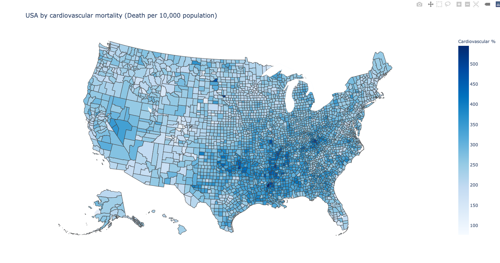

# USA_Mapping_Cardiovascular&Age

This code is done based on the generous help of [Marcos](https://github.com/marcos-acosta) and [Arielle](https://github.com/arielleisaacs), both members of the COVID 19 Risk Factor Group, Harvey Mudd College.

To run this code, you only need the requirements listed in `requirements.txt` and you can install them by running `pip install -r requirements.txt` in your working directory. 

(1) To generate the county level map for cardiovascular disease, run `testingCar.py` with python.

